# 补货通知自动镜像功能 / Restock Notification Mirroring Feature

## 功能概述 / Overview

当总部在总部通知频道/群组发布补货通知时，代理机器人会自动将该消息镜像转发到代理自己的补货通知频道/群组。

When headquarters posts a restock notice in the HQ notify channel/group, the agent bot automatically mirrors that message to the agent's own restock notification channel/group.

## 功能特性 / Features

### 1. 自动监听 / Automatic Monitoring
- ✅ 监听总部通知群 `HEADQUARTERS_NOTIFY_CHAT_ID` 的所有消息
- ✅ 支持文本、图片、视频、文档等多种消息类型
- ✅ Monitors all messages in `HEADQUARTERS_NOTIFY_CHAT_ID`
- ✅ Supports text, photos, videos, documents, and other message types

### 2. 关键词匹配 / Keyword Matching
- ✅ 可配置的补货关键词列表（默认支持中英文）
- ✅ 默认关键词：`补货通知, 库存更新, 新品上架, restock, new stock, inventory update`
- ✅ Configurable restock keywords (supports Chinese and English by default)
- ✅ Default keywords: `补货通知, 库存更新, 新品上架, restock, new stock, inventory update`

### 3. 智能转发 / Smart Forwarding
- ✅ 优先使用 `copy_message` 完整保留消息格式、媒体和 caption
- ✅ 如果 `copy_message` 失败（如权限问题），自动回退到 `send_message`
- ✅ 防止循环：只处理 `chat.id == HEADQUARTERS_NOTIFY_CHAT_ID` 的消息
- ✅ Preserves formatting, media, and captions using `copy_message`
- ✅ Falls back to `send_message` if `copy_message` fails (e.g., permission issues)
- ✅ Loop prevention: only handles messages where `chat.id == HEADQUARTERS_NOTIFY_CHAT_ID`

### 4. 可选按钮重写 / Optional Button Rewriting
- ✅ 可选功能：重写按钮指向代理机器人（默认关闭，提高安全性和简洁性）
- ✅ 如果启用，会将HQ消息中的按钮重写为指向代理机器人的按钮：
  - "🛒 购买商品" (url: https://t.me/{agent_bot_username})
- ✅ 当启用按钮重写时，不使用 copy_message，而是发送新消息并附带重写的按钮
- ✅ Optional: rewrite buttons to point to agent bot (off by default for safety and simplicity)
- ✅ If enabled, rewrites HQ message buttons to point to agent bot:
  - "🛒 购买商品" (url: https://t.me/{agent_bot_username})
- ✅ When button rewriting is enabled, does NOT use copy_message; sends new message with rewritten buttons

## 环境变量配置 / Environment Variables

### 必需配置 / Required Configuration

```bash
# 总部通知群ID（监听补货通知的来源）
# Headquarters notification chat/channel ID (source of restock notices)
HEADQUARTERS_NOTIFY_CHAT_ID=-1001234567890
# 或 / or
HQ_NOTIFY_CHAT_ID=-1001234567890

# 代理通知群ID（订单、充值、提现通知）
# Agent notification chat/channel ID (for orders, recharges, withdrawals)
AGENT_NOTIFY_CHAT_ID=-1009876543210
```

### 可选配置 / Optional Configuration

```bash
# 代理补货通知群ID（专门用于补货通知，如未设置则回退到 AGENT_NOTIFY_CHAT_ID）
# Agent restock notification chat/channel ID (dedicated for restock notices, falls back to AGENT_NOTIFY_CHAT_ID if not set)
AGENT_RESTOCK_NOTIFY_CHAT_ID=-1009876543211

# 补货关键词（逗号分隔，支持中英文）
# Restock keywords (comma-separated, supports Chinese and English)
RESTOCK_KEYWORDS=补货通知,库存更新,新品上架,restock,new stock,inventory update

# 是否启用按钮重写（1=启用，0=禁用，默认禁用）
# Enable button rewriting (1=enable, 0=disable, default is disabled)
HQ_RESTOCK_REWRITE_BUTTONS=0
```

## 配置示例 / Configuration Examples

### 示例 1：基本配置 / Example 1: Basic Configuration
```bash
# 最小配置：监听总部群，转发到代理通知群
# Minimal configuration: monitor HQ group, forward to agent notification group

HEADQUARTERS_NOTIFY_CHAT_ID=-1001234567890
AGENT_NOTIFY_CHAT_ID=-1009876543210
```

### 示例 2：专用补货通知群 / Example 2: Dedicated Restock Notification Channel
```bash
# 将补货通知单独转发到专用频道
# Forward restock notices to a dedicated channel

HEADQUARTERS_NOTIFY_CHAT_ID=-1001234567890
AGENT_NOTIFY_CHAT_ID=-1009876543210
AGENT_RESTOCK_NOTIFY_CHAT_ID=-1009876543211
```

### 示例 3：自定义关键词 / Example 3: Custom Keywords
```bash
# 添加自定义关键词
# Add custom keywords

HEADQUARTERS_NOTIFY_CHAT_ID=-1001234567890
AGENT_NOTIFY_CHAT_ID=-1009876543210
RESTOCK_KEYWORDS=补货,上新,到货,新货,补充库存,restock,new arrival,back in stock
```

### 示例 4：启用按钮重写 / Example 4: Enable Button Rewriting
```bash
# 启用按钮重写功能
# Enable button rewriting feature

HEADQUARTERS_NOTIFY_CHAT_ID=-1001234567890
AGENT_NOTIFY_CHAT_ID=-1009876543210
HQ_RESTOCK_REWRITE_BUTTONS=1
```

## 权限要求 / Permission Requirements

### 总部通知群 / Headquarters Notification Channel/Group
- ✅ 代理机器人必须是成员
- ✅ 需要读取消息权限
- ✅ Agent bot must be a member
- ✅ Needs permission to read messages

### 代理补货通知群 / Agent Restock Notification Channel/Group
- ✅ 代理机器人必须是成员
- ✅ 需要发送消息权限
- ✅ 需要发送媒体权限（如果转发包含图片/视频等）
- ✅ Agent bot must be a member
- ✅ Needs permission to send messages
- ✅ Needs permission to send media (if forwarding messages with photos/videos)

## 使用流程 / Usage Flow

```mermaid
graph LR
    A[总部发送补货通知] --> B{是否来自HQ通知群?}
    B -->|否| Z[忽略]
    B -->|是| C{是否包含关键词?}
    C -->|否| Z
    C -->|是| D{是否启用按钮重写?}
    D -->|是| E[发送新消息+重写按钮]
    D -->|否| F[尝试 copy_message]
    E -->|成功| G[✅ 转发成功]
    E -->|失败| H[❌ 记录错误]
    F -->|成功| G
    F -->|失败| I[尝试 send_message]
    I -->|成功| G
    I -->|失败| H
```



## 日志示例 / Log Examples

### 成功转发（未启用按钮重写）/ Successful Forwarding (Button Rewrite Disabled)
```
INFO - 🔔 检测到补货通知（关键词: 补货通知）: 🎉 【新品上架】TG账号大批量补货...
INFO - 📋 按钮重写未启用，使用 copy_message 转发原始消息
INFO - ✅ 补货通知已原样镜像到 -1009876543210 (message_id: 12345)
```

### copy_message 失败回退 / copy_message Fallback
```
WARNING - ⚠️ copy_message 失败（可能是权限问题）: Bad Request: not enough rights to send text messages to the chat
INFO - 🔄 尝试使用 send_message 回退方案...
INFO - ✅ 补货通知已通过回退方案发送到 -1009876543210
```

### 按钮重写（启用时）/ Button Rewriting (When Enabled)
```
INFO - 🔔 检测到补货通知（关键词: 补货通知）: 🎉 【新品上架】TG账号大批量补货...
INFO - 🔄 按钮重写已启用，将发送带重写按钮的新消息
INFO - ✅ 补货通知(图片+重写按钮)已发送到 -1009876543210 (message_id: 12345)
```

## 故障排除 / Troubleshooting

### 问题 1：消息未被转发 / Issue 1: Messages Not Being Forwarded

**可能原因 / Possible Causes:**
1. `HEADQUARTERS_NOTIFY_CHAT_ID` 配置错误
2. 机器人不在总部通知群中
3. 消息不包含配置的关键词

**解决方案 / Solutions:**
1. 检查 chat ID 是否正确（可通过日志或 @userinfobot 获取）
2. 确保机器人已加入总部通知群
3. 检查 `RESTOCK_KEYWORDS` 配置，确保包含总部使用的关键词

### 问题 2：copy_message 失败 / Issue 2: copy_message Fails

**可能原因 / Possible Causes:**
1. 代理机器人在目标群组没有发送消息权限
2. 代理机器人在目标群组没有发送媒体权限

**解决方案 / Solutions:**
1. 检查机器人在 `AGENT_RESTOCK_NOTIFY_CHAT_ID` 的权限
2. 确保机器人有发送消息和媒体的权限
3. 系统会自动使用 send_message 回退方案

### 问题 3：按钮重写不工作 / Issue 3: Button Rewriting Not Working

**可能原因 / Possible Causes:**
1. `HQ_RESTOCK_REWRITE_BUTTONS` 未设置为 `1`
2. 机器人没有在目标群组发送消息的权限
3. 消息发送失败

**解决方案 / Solutions:**
1. 设置 `HQ_RESTOCK_REWRITE_BUTTONS=1`
2. 检查机器人在 `AGENT_RESTOCK_NOTIFY_CHAT_ID` 的权限
3. 查看日志了解详细错误信息

## 安全性考虑 / Security Considerations

1. **循环防止 / Loop Prevention**
   - 只处理来自 `HEADQUARTERS_NOTIFY_CHAT_ID` 的消息
   - 不会重复转发已转发的消息

2. **按钮重写默认禁用 / Button Rewriting Disabled by Default**
   - 默认关闭按钮重写功能，避免误导用户
   - 只有明确需要时才启用

3. **权限最小化 / Minimal Permissions**
   - 机器人只需要读取和发送消息的基本权限
   - 不需要管理员权限

## 测试建议 / Testing Recommendations

1. **测试环境 / Test Environment**
   ```bash
   # 使用测试频道/群组
   # Use test channels/groups
   HEADQUARTERS_NOTIFY_CHAT_ID=-100TESTCHANNEL1
   AGENT_RESTOCK_NOTIFY_CHAT_ID=-100TESTCHANNEL2
   ```

2. **测试步骤 / Test Steps**
   - 在总部测试群发送包含关键词的消息
   - 确认消息被正确转发到代理测试群
   - 测试不同类型的消息（文本、图片、视频）
   - 验证按钮重写功能（如果启用）

3. **日志检查 / Log Verification**
   - 检查是否有 "🔔 检测到补货通知" 日志
   - 检查是否有 "✅ 补货通知已镜像" 日志
   - 如有错误，查看详细错误信息

## 版本历史 / Version History

### v1.0.0 (2025-01-15)
- ✅ 初始版本发布
- ✅ 支持自动监听和转发补货通知
- ✅ 支持多种消息类型
- ✅ 支持关键词配置
- ✅ 支持 copy_message 和 send_message 回退
- ✅ 支持可选的按钮重写功能
- ✅ 完善的日志记录和错误处理

## 技术实现细节 / Technical Implementation Details

### 代码位置 / Code Location
- **文件 / File**: `agent/agent_bot.py`
- **类 / Class**: `AgentBotHandlers`
- **方法 / Method**: `handle_headquarters_message()`
- **配置 / Config**: `AgentBotConfig.__init__()`

### 消息过滤器 / Message Filters
```python
MessageHandler(
    (Filters.text | Filters.photo | Filters.video | Filters.document) & 
    (Filters.chat_type.groups | Filters.chat_type.channel),
    self.handlers.handle_headquarters_message
)
```

### 关键词匹配逻辑 / Keyword Matching Logic
```python
message_text = update.message.text or update.message.caption or ""
for keyword in self.core.config.RESTOCK_KEYWORDS:
    if keyword and keyword.lower() in message_text.lower():
        is_restock = True
        break
```

### 转发优先级 / Forwarding Priority

当 `HQ_RESTOCK_REWRITE_BUTTONS=0`（默认）时：
1. **copy_message** (优先 / Priority)
   - 完整保留格式、媒体、caption
   - 保留原始消息的所有特性
   
2. **send_message** (回退 / Fallback)
   - 根据消息类型选择不同方法
   - send_photo / send_video / send_document / send_message

When `HQ_RESTOCK_REWRITE_BUTTONS=0` (default):
1. **copy_message** (Priority)
   - Fully preserves formatting, media, and captions
   - Retains all original message features
   
2. **send_message** (Fallback)
   - Selects method based on message type
   - send_photo / send_video / send_document / send_message

当 `HQ_RESTOCK_REWRITE_BUTTONS=1` 时：
- 直接发送新消息，不使用 copy_message
- 根据消息类型（图片/视频/文档/文本）发送带重写按钮的新消息
- 按钮内容：`"🛒 购买商品"` 指向 `https://t.me/{agent_bot_username}`

When `HQ_RESTOCK_REWRITE_BUTTONS=1`:
- Sends new message directly, does NOT use copy_message
- Sends new message with rewritten buttons based on message type (photo/video/document/text)
- Button content: `"🛒 购买商品"` pointing to `https://t.me/{agent_bot_username}`

## 常见问题 / FAQ

**Q1: 如何获取频道/群组的 chat_id？**
**A1:** 
- 方法1：使用 @userinfobot（转发一条消息到该bot）
- 方法2：查看机器人日志中的 chat_id
- 方法3：使用 Telegram API 的 getUpdates 方法

**Q2: 为什么按钮重写默认禁用？**
**A2:** 
- 安全性：避免用户误点击非官方按钮
- 简洁性：保持原始消息的完整性
- 灵活性：用户可根据需要启用

**Q3: 可以监听多个总部通知群吗？**
**A3:** 
- 当前版本仅支持一个总部通知群
- 如需监听多个，建议在总部合并通知到一个群

**Q4: 转发会保留原消息的转发标记吗？**
**A4:** 
- 使用 copy_message 时，消息作为机器人发送，不显示"转发自"
- 这样可以保持代理频道的独立性和专业性

**Q5: 如何临时禁用该功能？**
**A5:** 
- 方法1：移除 `HEADQUARTERS_NOTIFY_CHAT_ID` 环境变量
- 方法2：将 `RESTOCK_KEYWORDS` 设置为不可能匹配的值
- 方法3：将机器人从总部通知群移除

## 支持与反馈 / Support & Feedback

如有问题或建议，请通过以下方式联系：
For questions or suggestions, please contact via:

- GitHub Issues: https://github.com/biot9999/889/issues
- Telegram: @9haokf
